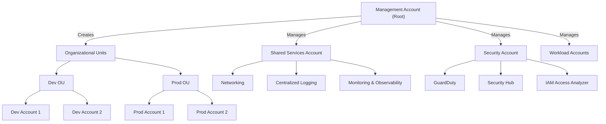

## Overview

**AWS-PLZ** is an open-source Terraform module designed to streamline the creation and management of personal AWS landing zones. Developed with the needs of cloud engineers, architects, and power users in mind, AWS-PLZ enables rapid provisioning of isolated AWS sandbox environments using best-practice account structures, minimal manual steps, and a focus on simplicity. While not intended for production-grade or highly regulated workloads, AWS-PLZ provides a robust foundation for experimentation, learning, and safe cloud prototyping.

A landing zone, in AWS parlance, is a well-architected, multi-account environment that establishes the baseline for governance, security, and scalability. AWS-PLZ embodies these principles at a personal or small-team scale, automating the setup of AWS Organizations, account vending, IAM user creation, and access policies. The module is intentionally lightweight: it uses static secrets for API access, stores Terraform state locally, and avoids complex dependencies, making it ideal for rapid onboarding and iterative development.

**Key objectives of AWS-PLZ:**

- **Rapid sandbox provisioning:** Quickly create new AWS accounts for isolated experimentation.
- **Minimal cost and overhead:** Designed to incur no ongoing AWS charges for idle resources.
- **Simplicity:** Minimal prerequisites, local state, and straightforward configuration.
- **Personal use focus:** Not intended for production or compliance-heavy environments.

AWS-PLZ is inspired by AWS’s own landing zone and Control Tower patterns, but is tailored for individuals and small teams who need a fast, reproducible way to manage their AWS playgrounds without the complexity of enterprise-scale solutions.

---

## Features

AWS-PLZ offers a focused set of features that align with the needs of personal cloud environments, while adhering to foundational AWS best practices:

| Feature                         | Description                                                                                  |
|----------------------------------|----------------------------------------------------------------------------------------------|
| **Automated AWS Organization**   | Creates an AWS Organization as the root for all sandbox accounts.                            |
| **Account Vending**              | Provisions new AWS accounts for sandbox use, each with unique email aliases.                 |
| **IAM User Bootstrapping**       | Sets up a personal IAM user with admin privileges for each account.                         |
| **Admin Access Policy**          | Grants the IAM user administrative access, with optional sub-account delegation.             |
| **Terraform-Driven**             | All resources are managed via Terraform for reproducibility and version control.             |
| **Local State Storage**          | Keeps Terraform state files local for simplicity (with guidance on secure alternatives).     |
| **Static Secrets (for API)**     | Uses static secrets for initial API access, with clear warnings on secret management.        |
| **Minimal Cost Footprint**       | Designed so that idle resources incur no AWS charges.                                       |
| **Easy Cleanup**                 | Supports safe teardown of accounts and resources when no longer needed.                     |
| **Example Configurations**       | Provides sample Terraform snippets for rapid onboarding.                                    |
| **Best Practice Guidance**       | Includes recommendations for security, state management, and account hygiene.               |

These features are intentionally scoped to balance ease of use with foundational security and governance, making AWS-PLZ a practical tool for personal cloud experimentation.

---

## Architecture

### Conceptual Overview

AWS-PLZ implements a simplified version of the AWS landing zone pattern, leveraging AWS Organizations to create a multi-account structure. The architecture consists of:

- **Management Account:** The root AWS account, used to create and manage the organization.
- **Sandbox Accounts:** One or more child accounts, each provisioned for isolated experimentation.
- **IAM Users:** Each account receives a personal IAM user with administrative privileges.
- **Access Policies:** IAM policies grant the necessary permissions for sandbox management.
- **Terraform State:** By default, state is stored locally, but users are encouraged to adopt secure backends for sensitive or multi-user scenarios.

This structure mirrors AWS’s own recommendations for workload isolation, blast radius reduction, and governance, albeit at a scale appropriate for individuals or small teams.

### Architecture Diagram

Below is a Mermaid diagram illustrating the core AWS-PLZ architecture:



**Diagram Explanation:**

- The Management Account initializes the AWS Organization.
- Each Sandbox Account is a member of the Organization, isolated from others.
- A personal IAM user is created in each account, with admin access.
- All resources are provisioned and managed via Terraform.

**Note:** For more complex scenarios (e.g., shared services, centralized logging), users should refer to AWS Control Tower or enterprise landing zone solutions.

---

## Installation and Setup

### Prerequisites

Before using AWS-PLZ, ensure you have the following:

- **AWS Account:** Access to a new or clean AWS account (recommended for isolation).
- **AWS CLI:** Installed and configured on your local machine.
- **Terraform:** Installed (version 1.0.0 or later recommended).
- **Email Aliases:** Ability to create unique email addresses for each sandbox account (many providers support plus-addressing, e.g., `user+dev@example.com`).
- **jq:** (Optional) For parsing Terraform outputs.

**Security Note:** The initial setup uses static secrets for API access. Treat these credentials with care and never commit them to public repositories.

### Step-by-Step Installation

1. **Clone the Repository**

   ```bash
   git clone https://github.com/PragmaticCloudArchitecture/AWS-PLZ.git
   cd AWS-PLZ
   ```

2. **Configure AWS CLI**

   - Log in to your AWS root account.
   - Create a new access key via the AWS Console (Security Credentials > Access Keys).
   - Configure the CLI:

     ```bash
     aws configure
     ```

   - Enter the access key and secret.

3. **Prepare Terraform Files**

   - Copy the example configuration or create your own `main.tf`, `provider.tf`, and `variables.tf`:

     ```hcl
     # provider.tf
     provider "aws" {
       region = "us-east-1"
     }

     # main.tf
     module "landing_zone" {
       source   = "github.com/PragmaticCloudArchitecture/AWS-PLZ"
       username = "your-username"
       accounts = {
         mysandbox01 = {
           name              = "Sandbox 01"
           email             = "yourname+sandbox01@example.com"
           close_on_deletion = true
         }
       }
     }
     ```

   - Adjust `username` and `accounts` as needed.

4. **Initialize and Apply Terraform**

   ```bash
   terraform init
   terraform apply
   ```

   - Review the planned actions and approve.

5. **Retrieve Credentials**

   - After apply, output variables will include access keys and passwords for the new IAM user:

     ```bash
     terraform output -json | jq .password.value
     ```

   - Use these credentials to configure the AWS CLI for your new user:

     ```bash
     aws configure
     ```

6. **Cleanup Root Credentials**

   - Delete the root account access key after bootstrapping.
   - Log in with your new IAM user for all further operations.

7. **State Management**

   - By default, Terraform state is stored locally. Add `.tfstate` files to `.gitignore` to avoid accidental commits:

     ```bash
     echo "*.tfstate\n*.tfstate.*" >> .gitignore
     ```

   - For advanced users, configure a remote backend (e.g., S3 with encryption and versioning) for better security and collaboration.

### Example Directory Structure

```
AWS-PLZ/
├── main.tf
├── provider.tf
├── variables.tf
├── output.tf
├── .gitignore
└── README.md
```

---

## Usage Examples

### Global Configuration (recommended)

AWS-PLZ now supports a root-level global configuration file (`config.yaml`) to centralize organization structure, account metadata, and default regions.

1. Copy and update `/config.yaml` values.
2. Pass `global_config_file` to modules.

```hcl
module "governance" {
  source             = "./platform/governance"
  global_config_file = "${path.root}/config.yaml"
}

module "connectivity" {
  source             = "./platform/connectivity"
  global_config_file = "${path.root}/config.yaml"
}
```

### Existing tfvars Workflow (still supported)

Current `*.tfvars` workflows are unchanged. You can continue to pass variables directly (for example with files under `templates/tfvars/`):

```bash
terraform plan -var-file=templates/tfvars/dev.tfvars.example
```

Direct variable values and `tfvars` values continue to take precedence over `config.yaml` values.

### Standardized Deployment Scripts

Use the included deployment scripts to run Terraform with consistent parameters and plan output paths (`./plans/<environment>`).

> **Note:** Terraform plan artifacts can contain sensitive values. If you use these scripts, consider adding `plans/` (and, if applicable, `*.tfplan`) to the `.gitignore` file in the working directory where you run them to avoid accidentally committing generated plan files.
```bash
./deploy.sh init -e dev -r us-east-1 -t templates/tfvars/dev.tfvars.example
./deploy.sh validate -e dev -r us-east-1 -t templates/tfvars/dev.tfvars.example
./deploy.sh plan -e dev -r us-east-1 -t templates/tfvars/dev.tfvars.example
./deploy.sh apply -e dev -r us-east-1 -t templates/tfvars/dev.tfvars.example
./deploy.sh destroy -e dev -r us-east-1 -t templates/tfvars/dev.tfvars.example
```

PowerShell equivalent:

```powershell
./deploy.ps1 init -Environment dev -Region us-east-1 -Tfvars templates/tfvars/dev.tfvars.example
./deploy.ps1 validate -Environment dev -Region us-east-1 -Tfvars templates/tfvars/dev.tfvars.example
./deploy.ps1 plan -Environment dev -Region us-east-1 -Tfvars templates/tfvars/dev.tfvars.example
./deploy.ps1 apply -Environment dev -Region us-east-1 -Tfvars templates/tfvars/dev.tfvars.example
./deploy.ps1 destroy -Environment dev -Region us-east-1 -Tfvars templates/tfvars/dev.tfvars.example
```

Both scripts prompt for manual confirmation before `apply` and `destroy`.

### Basic Module Usage

```hcl
module "landing_zone" {
  source   = "github.com/PragmaticCloudArchitecture/AWS-PLZ"
  username = "sam"
  accounts = {
    mysandbox01 = {
      name              = "Sandbox 01"
      email             = "sam+sandbox01@example.com"
      close_on_deletion = true
    }
  }
}
```

**Explanation:**

- `username`: The IAM username to create in each account.
- `accounts`: A map of account identifiers to their configuration.
- `close_on_deletion`: If true, the account will be closed when destroyed.

### Bootstrapping a New Landing Zone

1. **Create a new AWS account (if needed).**
2. **Configure AWS CLI with root credentials.**
3. **Run Terraform to provision the organization and sandbox accounts.**
4. **Switch to the new IAM user for all further operations.**

### Adding Additional Sandbox Accounts

To add more sandboxes, update the `accounts` map and re-apply Terraform:

```hcl
accounts = {
  mysandbox01 = { ... }
  mysandbox02 = {
    name              = "Sandbox 02"
    email             = "sam+sandbox02@example.com"
    close_on_deletion = true
  }
}
```

### Secure State Management (Advanced)

For production-like hygiene, configure a remote backend:

```hcl
terraform {
  backend "s3" {
    bucket         = "my-terraform-state-bucket"
    key            = "aws-plz/terraform.tfstate"
    region         = "us-east-1"
    encrypt        = true
    dynamodb_table = "terraform-lock-table"
  }
}
```

**Note:** Ensure the S3 bucket and DynamoDB table exist and are properly secured.

### Destroying the Landing Zone

To clean up all resources:

```bash
terraform destroy
```

- Accounts with `close_on_deletion = true` will be closed.
- Ensure you have removed all critical data before destroying.

---

## Best Practices

AWS-PLZ is intentionally simple, but following best practices ensures your sandbox remains secure and manageable:

### Security

- **Never share or commit secrets:** Do not push `.tfstate` files or credentials to public repositories.
- **Delete root access keys:** After bootstrapping, remove root credentials and use IAM users exclusively.
- **Use MFA:** Enable multi-factor authentication for all IAM users, especially those with admin privileges.
- **Principle of Least Privilege:** Grant only the permissions necessary for each user or role. For personal sandboxes, admin access is acceptable, but avoid this in shared or production environments.
- **Rotate credentials:** Regularly rotate access keys and passwords.

### State Management

- **Local state is for personal use only:** For team scenarios, use a remote backend (S3 + DynamoDB) with encryption and versioning.
- **Backup state files:** Even for personal projects, keep backups of your `.tfstate` files.

### Account Hygiene

- **Unique email addresses:** Use plus-addressing or unique emails for each sandbox account.
- **Tag resources:** Even in sandboxes, tag resources for easier tracking and cost allocation.
- **Clean up unused resources:** Regularly destroy or close accounts you no longer need.

### Cost Management

- **Monitor usage:** Use AWS Cost Explorer to track spending, even in sandboxes.
- **Set budgets and alerts:** Configure AWS Budgets to avoid unexpected charges.
- **Shut down idle resources:** Stop or terminate unused EC2 instances, RDS databases, and other billable resources.

### Compliance and Governance

- **Understand limitations:** AWS-PLZ is not intended for regulated or production workloads. For compliance, consider AWS Control Tower or similar solutions.
- **Audit logs:** Enable CloudTrail and review logs periodically, even in sandboxes.

---

## Security Considerations

While AWS-PLZ is designed for personal use, security remains paramount:

- **Static Secrets:** The module uses static secrets for initial API access. Treat these as sensitive and rotate them after setup.
- **Local State Risks:** Local `.tfstate` files may contain secrets. Protect them with file permissions and never commit to version control.
- **IAM User Management:** Each sandbox account receives an admin IAM user. Use strong, unique passwords and enable MFA.
- **No Production Guarantee:** The module is not hardened for production. Do not use for workloads requiring compliance, high availability, or advanced security controls.
- **Manual Cleanup:** Always verify that accounts and resources are destroyed when no longer needed to avoid lingering access or costs.

For more robust security, consider integrating additional AWS services such as AWS Config, GuardDuty, and Security Hub, or migrate to a more comprehensive landing zone solution as your needs evolve.

---

## Contribution Guidelines

We welcome contributions from the community! To ensure a smooth collaboration process, please follow these guidelines:

### How to Contribute

- **Bug Reports:** Search existing issues before submitting. Include clear steps to reproduce, expected vs. actual behavior, and relevant logs or error messages.
- **Feature Requests:** Describe the problem you’re trying to solve, proposed solutions, and any alternatives considered.
- **Documentation Improvements:** Fix typos, clarify confusing sections, or add usage examples.
- **Code Contributions:** Fork the repository, create a feature branch, and submit a pull request (PR) with a clear description of your changes.

### Development Setup

1. Fork the repository on GitHub.
2. Clone your fork locally:

   ```bash
   git clone https://github.com/YOUR_USERNAME/AWS-PLZ.git
   cd AWS-PLZ
   ```

3. Create a new branch for your changes:

   ```bash
   git checkout -b feature/your-feature-name
   ```

4. Make your changes and commit with clear messages.
5. Push your branch and open a PR against `main`.

### Pull Request Process

- Ensure your branch is up to date with `main`.
- Run `terraform fmt` and `terraform validate` to check formatting and syntax.
- Add or update documentation as needed.
- Complete the PR template and respond to review feedback.

### Code Style

- Follow [Terraform style conventions](https://www.terraform.io/docs/language/syntax/style.html).
- Use descriptive variable and resource names.
- Document complex logic with comments.

### Community Standards

- Be respectful and constructive in all interactions.
- Adhere to the project’s [Code of Conduct](CODE_OF_CONDUCT.md).
- Recognize and credit contributors in release notes.

### Issue and PR Templates

- Use the provided templates for bug reports, feature requests, and pull requests to ensure all necessary information is included.

**For more detailed guidance, see [CONTRIBUTING.md](CONTRIBUTING.md) in the repository.**

---

## License

AWS-PLZ is released under the **Apache License 2.0**.

**Key points:**

- **Permissive:** Allows use, modification, and distribution, including in proprietary projects.
- **Attribution:** Requires preservation of copyright and license notices.
- **Patent Grant:** Includes a patent license from contributors.
- **No Warranty:** Provided “as-is” without warranty.

For the full license text, see [LICENSE](LICENSE) in the repository or visit the [Apache License 2.0](https://www.apache.org/licenses/LICENSE-2.0) page.

---

## Resources

### Official Documentation

- [AWS Organizations](https://docs.aws.amazon.com/organizations/latest/userguide/orgs_introduction.html)
- [AWS Control Tower](https://docs.aws.amazon.com/controltower/latest/userguide/what-is-control-tower.html)
- [Terraform Documentation](https://www.terraform.io/docs/)
- [AWS CLI Documentation](https://docs.aws.amazon.com/cli/latest/userguide/cli-chap-welcome.html)

### Reference Architectures and Best Practices

- [AWS Landing Zone Reference Architecture](https://aws.amazon.com/architecture/reference-architecture-diagrams/)
- [AWS Well-Architected Framework](https://docs.aws.amazon.com/wellarchitected/latest/framework/welcome.html)
- [AWS Multi-Account Strategy](https://docs.aws.amazon.com/controltower/latest/userguide/aws-multi-account-landing-zone.html)
- [Terraform AWS Landing Zone Modules](https://github.com/MitocGroup/terraform-aws-landing-zone)

### Security and Compliance

- [AWS Security Best Practices](https://aws.amazon.com/security/)
- [IAM Best Practices](https://docs.aws.amazon.com/IAM/latest/UserGuide/best-practices.html)
- [CloudTrail and Logging](https://docs.aws.amazon.com/awscloudtrail/latest/userguide/cloudtrail-user-guide.html)
- [AWS Config](https://docs.aws.amazon.com/config/latest/developerguide/)

### Community and Examples

- [Similar Projects: terraform-aws-landing-zone](https://github.com/MitocGroup/terraform-aws-landing-zone)
- [Awesome README Examples](https://github.com/matiassingers/awesome-readme)
- [How to Structure Your README](https://www.freecodecamp.org/news/how-to-structure-your-readme-file/)

### Diagrams and Visualization

- [Mermaid Diagrams in GitHub Markdown](https://docs.github.com/en/get-started/writing-on-github/working-with-advanced-formatting/creating-diagrams)
- [AWS Architecture Icons](https://aws.amazon.com/architecture/icons/)

### Contribution and Community Health

- [GitHub Contributing Guidelines](https://docs.github.com/en/communities/setting-up-your-project-for-healthy-contributions/setting-guidelines-for-repository-contributors)
- [Security Policy Setup](https://docs.github.com/en/code-security/how-tos/report-and-fix-vulnerabilities/configure-vulnerability-reporting/adding-a-security-policy-to-your-repository)

---

## Maintainers and Support

For questions, issues, or feature requests, please open an issue in the [GitHub repository](https://github.com/PragmaticCloudArchitecture/AWS-PLZ.git).

**Note:** This project is community-supported. For urgent or production-grade needs, consider AWS Support or professional services.

---

## Release Management

AWS-PLZ follows [semantic versioning](https://semver.org/) for releases. Release notes and changelogs are published with each new version. Automated dependency updates and security scanning are enabled via GitHub Dependabot.

---

## Acknowledgments

AWS-PLZ draws inspiration from AWS’s own landing zone patterns, the broader Terraform community, and numerous open-source contributors. Special thanks to all users who provide feedback, report issues, and contribute improvements.

---

**Start building your personal AWS landing zone today with AWS-PLZ—empowering safe, rapid, and reproducible cloud experimentation.**

---
